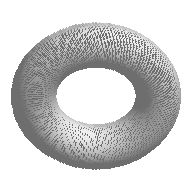

# Heavy-mesh thumbnail hardening

## Follow-up: binary STL consistency correction (2026-09-11)

The original eligibility condition was `ext == ".stl" and size_bytes >= preview_geometry.MIN_FAST_STL_BYTES`, with `MIN_FAST_STL_BYTES = 8 * 1024 * 1024`. It left smaller binary STL files on the legacy renderer, explaining the observed visual cutoff.

The condition is now `ext == ".stl"`; the unused minimum-size constant is removed. The existing reader still validates an 84-byte minimum, a positive little-endian uint32 triangle count, and exact length `84 + count * 50`, including valid binary headers beginning with `solid`. Only successfully prepared geometry reaches the solid renderer; ASCII, malformed, degenerate, or unsupported data falls back. PNG hits still bypass geometry, and compact-cache hits bypass source parsing.

`THUMBNAIL_STYLE_VERSION` was bumped exactly once from `thumbnail_style_v3` to `thumbnail_style_v4`. Existing rendered-cache entries become misses on the next render request; no cache directory is deleted. The preview recipe and geometry cache remain valid. Existing bridge/index thumbnails already displayed in a running app still require the normal regeneration workflow; this patch does not redesign thumbnail scheduling or indexes.

Nine additional tests cover automatic compact routing at 284 bytes, 1.53 MiB, 3.81 MiB, 7.00 MiB, and 8.58 MiB; source preservation; actual ASCII/malformed fallback; unchanged other-format routing; independently generated deterministic PNGs; and v3 PNG invalidation while retaining geometry and old cache files. Existing cache-hit, geometry-reuse, heavy-mesh, and lifecycle tests remain in place. The old test-only minimum-size override was removed, so tests now exercise production eligibility.

Validation: **82 core tests passed** (1.715 s), followed by **258 focused thumbnail/render/routing/lifecycle tests** (62.545 s). The full suite was then run **once: 802 tests in 1236.185 s, OK (skipped=2), exit code 0**. The two skips remain missing acceptance folders and the single-monitor sizing check. Final core/focused/full logs contain zero matches for `QThread:`, `QFont::`, `Traceback`, `has been deleted`, `QObject::`, `QWidget::`, and `QWidget:`. `git diff --check` passed. No production code changed during or after the full run.

Files changed in this follow-up: `mesh_render_pipeline.py`, `preview_geometry.py`, `render_cache.py`, `test_heavy_mesh_preview.py`, `test_thumbnail_quality_regression.py`, this report, and `docs/CHANGELOG.md`.

OBJ/PLY/GLB/GLTF rendering is unchanged. The shared PNG style key changes their cache identity as well, but their rendering routes are untouched. Fast Proxy/Balanced/HQ selection, Blender fallback, queues/backpressure, viewport cancellation, UI caches, APP_VERSION, and frozen core architecture are unchanged. Source assets are never modified.

The remaining sections and benchmark artifacts below describe the **original heavy-mesh hardening baseline**; their former 8 MiB eligibility and 100k legacy-path observations are historical, not the current policy.

---

Date: 2026-09-11. Implemented in `E:\Mesh package\MeshStager`; requested `O:` drive was unavailable. APP_VERSION remains `0.1.0-rc1`.

## Findings and root bottleneck

`NativeThumbnailBackend` already delegates to `MeshRenderPipeline`, and the UI already has asynchronous image decoding, bounded pixmap/scaled-image caches, viewport epochs, and scroll suppression. Those systems were retained.

The previous large-mesh proxy still called `trimesh.load`, computed metadata and full vertex normals, and normalized all vertices before selecting splat points. On the 2.25M-triangle fixture, import took 3.003 s and geometry/array preparation took 1.739 s; splat rasterization itself took only 0.030 s. Faster point drawing could not address that bottleneck. The old balanced path also selected sparse faces and performed Python pixel loops.

## Architecture and heavy-STL strategy

After the existing PNG cache lookup, STL files at least 8 MiB try the compact geometry cache. A miss uses a binary reader inside the existing native worker. Other formats, smaller files, and unsupported STLs retain the existing loader and renderer.

The reader validates the 84-byte header/count and exact `84 + 50 * triangle_count` file length. A `solid` header does not incorrectly classify valid binary STL as ASCII. Empty, truncated, inconsistent, nonfinite, and degenerate data are rejected.

Two bounded sequential passes replace the full trimesh object. The first finds exact bounds and validates coordinates. The second quantizes vertices to an isotropic grid, removes collapsed faces, canonicalizes triangle winding cyclically, and merges duplicate clustered triangles. Every triangle is visited, including the end of the file. This intentionally goes beyond uniform face sampling: dropping most disconnected faces would create holes, while clustering keeps shared vertices connected at preview scale.

Chunks contain at most 32,768 triangle records. Retained geometry is capped at 180,000 triangles. A model exceeding that budget retries at a coarser grid, then falls back if it still cannot produce a usable representation. Bounds and normals use vectorized NumPy operations; source normals are recomputed only for surviving faces rather than constructing full vertex-normal arrays. Source files are opened read-only and never changed. File size/mtime are checked again before publishing geometry.

Sequential reads were chosen over memory mapping: concurrent truncation of a mapped file can cause process-level faults that Python exceptions cannot safely recover from. No source-sized Python object collection or source mesh survives preprocessing.

## Cache design and behavior

Effective order remains existing UI pixmap caches → existing disk PNG cache → new compact geometry cache → source/staging/loader.

The new disposable cache is `USER_DATA_DIR/cache/preview_geometry`, normally `%LOCALAPPDATA%/MeshStager/cache/preview_geometry`. Identity is SHA-256 of canonical, platform-case-normalized source path, source size, nanosecond mtime, `PREVIEW_GEOMETRY_VERSION`, and quality tier. No source-content hashing occurs during browsing.

Each entry stores only normalized float32 triangles and unit face normals: an uncompressed, non-pickled NPY array with a SHA-256 payload trailer. Header, dtype, shape, byte size, finite coordinates, and checksum are validated before use; allocation is capped before reading payload. Maximum payload is 8.24 MiB per entry. Typical smooth fixtures are much smaller. Temporary files are atomically replaced, and failed writes clean up their temporary files.

PNG hits return before opening geometry. Geometry hits occur before network staging, so a different pixel size or visual-style version can regenerate from compact arrays without copying or reparsing the original source. Different quality tiers use separate recipes; first HQ generation may preprocess once for its finer grid. Changing only the preview recipe invalidates preview geometry independently; changing rendered appearance also requires the PNG style version bump.

The existing PNG architecture is retained. Demonstrated failure cases were fixed: corrupt sidecar types previously escaped conversion guards, cache directory creation occurred during reads, and direct writes could publish incomplete PNGs or fail the whole thumbnail on permission errors. PNG and metadata publication now use atomic individual replacements; metadata includes a checksum of the small output PNG. Corruption or a concurrent mismatched pair becomes a cache miss. Cache write failures no longer discard usable rendered bytes. `THUMBNAIL_STYLE_VERSION` is now `thumbnail_style_v3` to invalidate legacy rendered appearance.

## Quality tiers and appearance

Existing tier selection, output sizes, and UI labels are unchanged. Compact grids are 64 cells across the longest dimension for Fast Proxy, 96 for Balanced Preview, and 120 for HQ Preview. HQ remains explicit; heavy STL does not automatically invoke Blender.

The compact path draws depth-sorted shaded triangles with Pillow's C polygon rasterizer, using the established 45-degree/35.264-degree canonical orientation, 6% padding, neutral grayscale, ambient plus directional lighting, transparent background, and 3x antialiasing at up to 192px (2x above). It adds no floor, grid, or wireframe. PNG encoding is measured separately. The old surface/splat pipeline remains the fallback.

The 2.25M-triangle proxy comparison below is the actual generated output, not a mockup:

| Before | After |
|---|---|
|  |  |

Visual inspection confirmed a solid shaded ring and retained opening. Automated coverage checks transparent corners, solid interior coverage, antialiasing, an open center, and deterministic output geometry.

## Benchmark method and actual measurements

`python scripts/benchmark_mesh_thumbnails.py file1.stl file2.stl --output results.json --images output_images` accepts user-supplied files and never changes them. `--synthetic-dir DIRECTORY` generates 100k, 500k, 1M, and 2.25M triangle tori outside the repository. There are no large committed fixtures.

Each file is measured in a fresh subprocess with isolated empty application caches and **no warm-up**. Cold time covers the first renderer invocation, including lazy trimesh/SciPy loading in the legacy path; common module imports and process launch are outside that interval. This does not claim flushed OS storage caches. Warm output timing measures the next PNG hit, and regeneration changes output size while retaining compact geometry. Windows `GetProcessMemoryInfo` reports process peak working set after the cold render, including imported libraries and native NumPy allocations.

Environment: Windows AMD64; Python 3.13.14; NumPy 2.5.3; trimesh 5.1.0; SciPy 1.18.1; Pillow 12.3.0. No new dependency was installed for this task. Measurements below are single cold invocations, not a statistical distribution. Baseline was captured before changing production code; final measurements were taken after focused integration tests completed.

**These are synthetic performance measurements, not validation on real print models.** Available local STL assets were tiny demo placeholders. The torus meshes have distinct surface triangles and a genuine opening; they are not repetitions of one triangle. Separate repeated-tetrahedron test fixtures exercise million-record parsing without being used for performance claims.

| Triangles / unchanged tier | Before cold (s) | After cold (s) | Speedup | Before peak MiB | After peak MiB | PNG hit (ms) | Geometry reuse (ms) |
|---|---:|---:|---:|---:|---:|---:|---:|
| 100,000 / balanced | 1.393 | 0.919 | 1.52x | 175.7 | 175.2 | 5.93 | 467.45 |
| 500,000 / balanced | 1.555 | 0.243 | 6.39x | 394.0 | 73.3 | 7.28 | 55.81 |
| 1,000,000 / balanced | 2.703 | 0.411 | 6.58x | 667.1 | 74.9 | 5.29 | 57.62 |
| 2,250,000 / proxy | 4.795 | 0.753 | 6.37x | 1349.6 | 63.8 | 5.43 | 33.76 |

The 100k file stays on the original path; its timing difference is cold-process/runtime variability and is not attributed to this optimization. The exact 1M binary file is 50,000,084 bytes, just below the existing 48 MiB proxy threshold, so it remains Balanced Preview. The 2.25M file exercises Fast Proxy. Heavy-fixture cold improvements exceed the 2x target, with approximately 81–95% lower process peak memory.

Stage times in seconds (minor overhead outside these stages remains in total):

| Fixture / run | Stat/cache | Source read/import | Geometry metadata + arrays | Compact preparation/cache | Raster | PNG encode | PNG write |
|---|---:|---:|---:|---:|---:|---:|---:|
| 100,000 / before | 0.0003 | 0.9075 | 0.0736 | 0.0000 | 0.3828 | 0.0239 | 0.0009 |
| 500,000 / before | 0.0004 | 0.9706 | 0.3861 | 0.0000 | 0.1819 | 0.0117 | 0.0009 |
| 1,000,000 / before | 0.0003 | 1.6229 | 0.8093 | 0.0000 | 0.2540 | 0.0120 | 0.0009 |
| 2,250,000 / before | 0.0003 | 3.0027 | 1.7395 | 0.0000 | 0.0304 | 0.0173 | 0.0009 |
| 100,000 / after | 0.0003 | 0.5115 | 0.0662 | 0.0000 | 0.3230 | 0.0138 | 0.0014 |
| 500,000 / after | 0.0003 | 0.0150 | 0.0000 | 0.1649 | 0.0452 | 0.0139 | 0.0013 |
| 1,000,000 / after | 0.0003 | 0.0303 | 0.0000 | 0.3160 | 0.0469 | 0.0132 | 0.0012 |
| 2,250,000 / after | 0.0003 | 0.0694 | 0.0000 | 0.6418 | 0.0250 | 0.0125 | 0.0013 |

The original renderer combines rasterization and PNG encoding; the benchmark separately instruments Pillow encoding and subtracts it for the baseline raster column. Geometry preparation includes metadata plus full array/normal preparation. Compact preparation includes geometry-cache lookup/publication and vectorized clustering, while direct source reads are reported separately. Final profiler records expose these stages directly for the new path. An existing double-count of network staging time was removed.

Raw measurements: [before.json](heavy_mesh_benchmark/before.json), [after.json](heavy_mesh_benchmark/after.json). Source paths in these reports are reduced to fixture names for portability.

## Threading, priority, memory, and fallback

No UI/queue code changed. Native work still runs in the existing QThreadPool with the existing eight-job in-flight cap, duplicate rejection, and shutdown guards. Existing selected/visible/prefetch policy, epoch cancellation, stale decode dropping, and fast-scroll suppression remain intact. Running native jobs remain non-preemptive; this change shortens their heavy preprocessing rather than introducing a scheduler. No geometry parsing or rasterization was added to any UI callback.

Only active workers hold chunk/preprocessing/raster arrays. Geometry has no process-global in-memory cache and no additional decoded-image LRU. A worker retention test verifies geometry arrays are collectible after completion. Output cache hits cannot call the loader or geometry reader, and preview hits cannot call the original loader or binary reader. Metadata receives `None` from the compact branch, never inaccurate preview face/vertex counts; existing metadata enrichment remains responsible for original geometry statistics.

Unsupported/ASCII/malformed STL, failed compact rendering, source changes, and preprocessing errors return to the original pipeline. Network interruptions retain the native backend/router's existing failure/fallback handling. Bad cache data is regenerated; read-only caches still allow rendering. Diagnostics use existing logging and do not add raw parser exceptions to user-facing text.

## Validation

- 34 new focused tests cover structural STL parsing, headers, deterministic selection, whole-range coverage, small meshes, streamed 500k/1M fixtures, source preservation, cache identity, cache hits, size/style regeneration, tier identity, network-hit staging bypass, truncation/change recovery, permission failures, hostile/corrupt array headers and payloads, concurrent writes, PNG corruption, solid/transparent output, preserved openings, and worker retention.
- 249 tests passed across 26 focused thumbnail, renderer, cache, routing, viewport/throttle, and teardown modules in 50.495 seconds.
- After the final stat timing instrumentation, 41 relevant tests passed in 1.117 seconds.
- Full regression: **793 tests in 839.131 seconds, OK (skipped=2)**; executed once after focused tests passed. The skips are the existing missing TestSource/TestDestination acceptance folders and the single-monitor sizing check. Process exit code: 0.
- Final focused/full test logs contain **zero** matches for `QThread:`, `QFont::`, `Traceback`, `has been deleted`, `QObject::`, `QWidget::`, `QWidget:`, and `Internal C++`. No test failures/errors. See [validation.json](heavy_mesh_benchmark/validation.json).
- `git diff --check` passed. No production code changed during or after the full run.

## Files added and modified

Added:

- `meshcorral/services/render/preview_geometry.py`
- `meshcorral/services/render/solid_preview.py`
- `meshcorral/tests/test_heavy_mesh_preview.py`
- `scripts/benchmark_mesh_thumbnails.py`
- `docs/THUMBNAIL_HEAVY_MESH_HARDENING.md`
- `docs/heavy_mesh_benchmark/{before.json,after.json,proxy_before.png,proxy_after.png,validation.json}`

Modified:

- `meshcorral/services/render/mesh_render_pipeline.py`: compact cache/reader integration and stages.
- `meshcorral/services/render/render_cache.py`: style invalidation and safe atomic cache I/O.
- `meshcorral/services/render/render_timing_profiler.py`: additive stage fields and compact-cache diagnostics.
- `meshcorral/tests/test_thumbnail_quality_regression.py`: existing style-version expectation updated to v3; all existing checks retained.
- `docs/CHANGELOG.md`: hardening entry.

## Remaining bottlenecks and limitations

- Cold heavy-STL time is now dominated by bounded vectorized clustering and sequential source reads; network staging remains expensive when neither cache exists.
- Fine details/openings below a clustering cell may merge or disappear. HQ has a finer grid but remains a preview, not a topology-preserving mesh simplifier or manufacturing validation tool.
- Depth-sorted triangle drawing approximates visibility. Large intersecting/overlapping triangles can show painter-order artifacts; a true depth buffer would be a future improvement requiring further benchmarks. Real sculpted, thin-featured, disconnected, and pathological production assets need broader visual acceptance testing.
- OBJ/PLY/GLB/GLTF, small STL, and fallback paths retain their existing import/normal/raster costs. No universal importer rewrite was attempted.
- Path/size/mtime identity cannot detect edits deliberately preserving all metadata. Source hashes are intentionally avoided.
- Persistent geometry entries are disposable but not automatically evicted by a new disk-retention policy. Old recipe/source generations can be manually removed from this cache directory. Memory is bounded independently of repository asset count.
- No large repository desktop soak test or frozen executable rebuild was performed. Measurements concern source-build rendering and automated regression coverage.

Frozen scan/cancellation, metadata-cache architecture, gallery/table/Inspector architecture, Tags, Favorites, Collections, search, layouts/dialogs, shutdown architecture, rebrand migration, and transfers were not redesigned. Thumbnail routing, Blender fallback, existing image caches, package name, APP_VERSION, and `roundup.log` remain unchanged.
